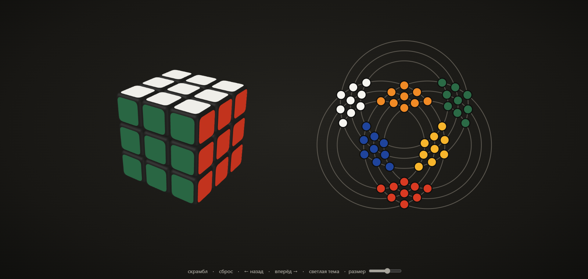
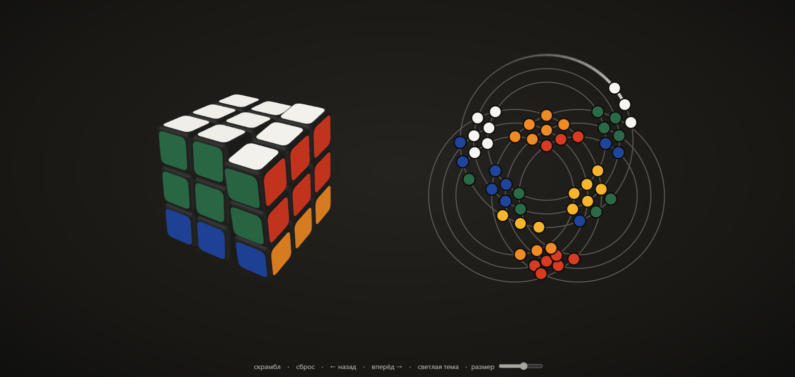
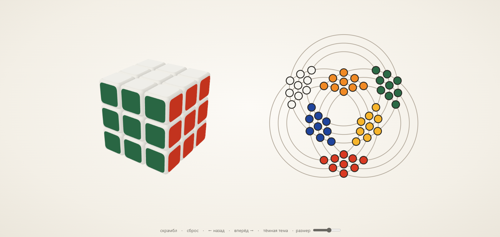
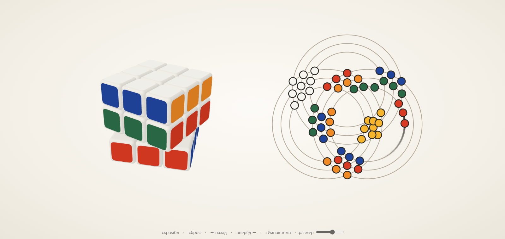

# Rubik Graph

Кубик Рубика и граф его наклеек на одном экране: крутишь кубик, и вершины графа едут по окружностям; тянешь вершину в графе, и кубик делает тот же поворот. Слева 3D-кубик, справа граф из 54 вершин, и обе половины живые.

- **Сайт**: один `index.html` без сервера, открывается двойным кликом и работает на GitHub Pages.
- **Кубик**: настоящая 3D-модель на three.js, слои крутятся мышью с анимацией.
- **Граф**: три семейства концентрических окружностей, 54 вершины в точках их пересечения.

## Скриншоты

**Тёмная тема (по умолчанию)**



**Поворот слоя: вершины едут по окружностям, за ними тянется хвост**



**Светлая тема**





## Как устроен граф

У кубика 54 наклейки. Каждый поворот слоя переставляет часть из них по циклам. Граф рисует эти циклы как есть:

- у каждой из трёх осей кубика есть три слоя, и каждому слою соответствует окружность, всего девять;
- наклейка лежит на двух окружностях (по одной для двух осей, перпендикулярных её грани), поэтому вершина стоит в точке их пересечения;
- при повороте слоя его 12 боковых вершин едут по своей окружности, а 8 вершин самой грани по дугам окружностей, а где нужно, то через общую вершину пересечения. Вершина никогда не уходит с линий графа.

## Управление

| Действие | Как |
|---|---|
| Вращать кубик целиком | мышь по пустому месту рядом с кубиком |
| Повернуть слой кубика | потянуть мышью по грани в нужную сторону |
| Повернуть слой через граф | потянуть вершину вдоль окружности |
| Повернуть грань | клик по вершине графа |
| Ход клавишей | `U` `R` `F` `D` `L` `B`, с `Shift` обратный ход |
| Шаг назад и вперёд | кнопки внизу, `←` и `→`, `Ctrl+Z` и `Ctrl+Y` |
| Перемешать, сбросить | кнопки «скрамбл» и «сброс» |
| Размер и тема | ползунок «размер» и кнопка темы внизу |

## Запуск

```
npm install        # зависимости
npm run dev        # режим разработки, http://localhost:5173
npm test           # тесты модели и графа
npm run build      # сборка в один файл docs/index.html
```

## Публикация на GitHub Pages

Собранный сайт уже лежит в `docs/index.html`, достаточно включить Pages:

1. Открой Settings → Pages.
2. Source: Deploy from a branch, ветка `main`, папка `/docs`.

Через минуту сайт откроется по адресу `https://<имя>.github.io/<репозиторий>/`.
После изменений кода выполни `npm run build` и закоммить обновлённый `docs/index.html`.

## Структура

| Папка | Что внутри |
|---|---|
| `src/model/` | наклейки, ходы как перестановки, кольца слоёв, цвета; не знает про интерфейс |
| `src/graph/` | раскладка вершин по окружностям, дорожки, движение вершин по линиям, разбор перетаскивания |
| `src/app/` | очередь ходов с историей назад и вперёд, общий таймер анимации |
| `src/views/` | 3D-кубик на three.js и SVG-граф |
| `tests/` | тесты на ходы, кольца, раскладку графа и очередь ходов |
| `docs/` | собранный сайт `index.html`, скриншоты для README, спека и план разработки |

## Технологии

TypeScript, Vite, three.js, SVG. Тесты на Vitest.
